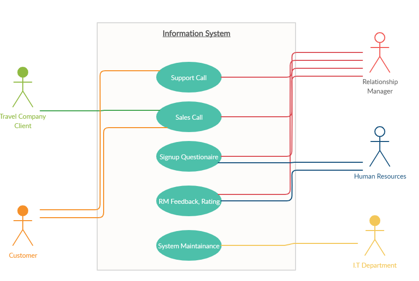
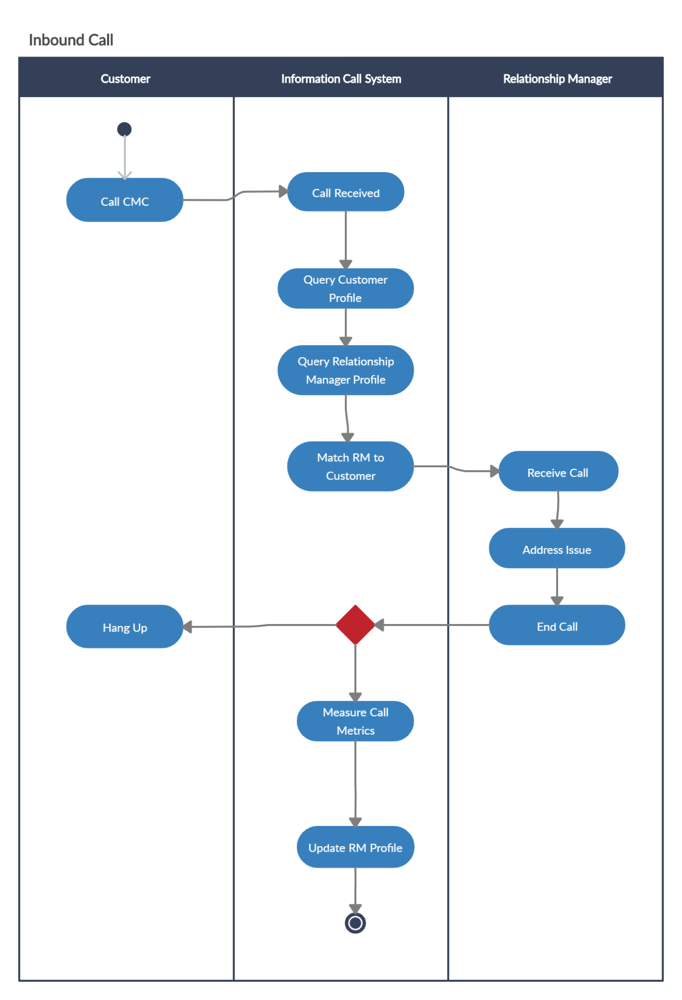
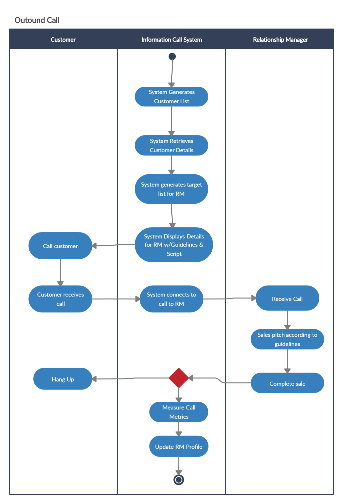
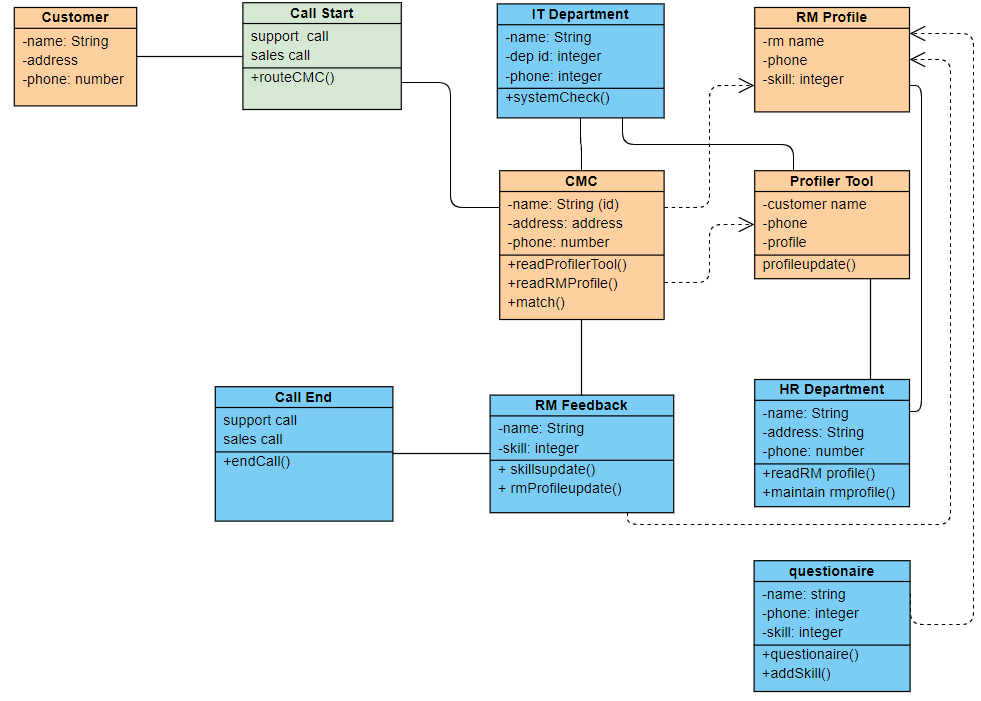

# Information System Development Methodologies 
#### Assignment Project :50%
#### Team Members: Rageeb MowLa, Heti Bhagat, Trieu Tien Duc
## The video part of our report can be viewed here: [Link](https://youtu.be/1VX5qRoIcL8)

## Content
>1. Problem definition: Objectives, List of Stakeholders:
>+ Problem definition: Objectives, List of Stakeholders. 
>+ Define problems within current system:	 	
>+ Objectives of the New System:	 
>+ Identify stakeholders.	 
>+ Empathy Maps & POV Statements	 
>2. Design Thinking approach to address the problem with artefacts:
>+ Describe your approach from a Design Thinking principles perspective.
>+ Reflections & 'How Might we statement'. 
>3. Work products, models and descriptions	 
>+ Use Case Diagram.	 
>+ Activity Diagram.	 
>+ Class Diagram.	 
>4. Competitive advantages and possible effects if the project fails:	 
>+ Discuss the competitive advantages might be gained in developing the new information.	 
> + Identify and discuss the possible adverse effects for this Business if its information system project fails.	 
>+ Using GitHub to role-play agile methodologies	. 
> 5. References

## **Problem definition: Objectives, List of Stakeholders**
### *Outline the objectives of the project and define the problem (Steps 1 & 2 of Design Thinking Methodology)*
#### Define problems within current system:
> 1.	The lack of knowledge to handle an information system to manage the CMC in terms of handling call routing and dynamic call flow control for both inbound and outbound calls, assisting RMs in serving their end-customers and matching RMs and end- customer profiles.
>2.	The system operation is complicated by the varying number and nature of holiday packages offered by the travel company. 
>3.	The call flow rate is sub purr due to the lack of performance-based matching of RMs to Customers.
>4.	The System does not match RM profiles based on performance in selling thus customers are not served efficiently and effectively. 
a.	System does not use Skill matcher between customer and RMs profile. 
>5.	The service being provided to end customers is not of quality which resulted in loss of potential buyers for outbound calls. 
>6.	The inbound call costs are high due to long call-handling time. 
>7.	Customers may experience delays and long wait times to be directed to a RM during busy periods. 
#### Objectives of the New System: 
>1.	To improve the operation of the in-house call management centre (CMC)
>2.	Provide improved call routing and dynamic call flow control for both inbound and outbound calls. 
>3.	To improve call flow rate, match customers based on RM performance and product knowledge. 
>4.	To increase the chance to achieve a sale or provide better service, RM will use matching techniques such as; segmenting customers into social, cultural and behavioural segments. 
>5.	The system will adjust according to RMs subsequent performance in selling packages and in serving customers effectively and efficiently.
>6.	Outbound calls need to be optimised by providing the RM with an effective guideline and script, crafted to help create the best user experience for the customer. 
>>a.	Create a target list for RM based on skill & profile.
>7.	Minimise inbound call costs by reducing per-call handling time
>>a.	Rank customers according to their propensity to purchase using a scale of 1-10 Serve those with highest likelihood of buying first
>8.	To reduce customer waiting time during busy periods, an interactive voice response unit is used until the first available RM. 
>9.	Calls that are received by RMs are based on skill levels and best match.
#### Identify stakeholders.
>1.	Customers 
>2.	Relationship Managers
>3.	IT Team
>4.	Human Resources Team
>5.	Travel company clients 
#### Empathy Maps & POV Statements
##### Stakeholder 1: Customers
|   User  |      Need   |  Insight|
|:----------:|:-------------:|:------:|
| An individual that calls into the CMC to receive support or receives calls from the CMC as a sales target. |  To either have their support issue addressed in a quick and efficient manner or receive a pitch for a product pertinent to their requirements | The user wants to have low wait times when calling into the CMC and to be connected to the employee best suited to addressing their issue. They would also want to avoid unnecessary hand-offs or transfers to reduce complexity. Customers receiving calls from the CMC would like to have a concise pitch of the product so they can quickly decide if it is something they want to further pursue
 |
 ##### Empathy Map:

##### Stakeholder 2: Relationship Manager (RM) 

|   User  |      Need   |  Insight|
|:----------:|:-------------:|:------:|
|Relationship Manager (RM) are employees that use the system to interact with customers in either a sales or support role depending on the situation  |         They need to be matched to customers appropriate to their knowledge & skill level so they can provide a quality service    |      RM’s want to be able to help assist customers promptly and efficiently to give them the best experience possible. This will help them in both customer retention and in sales conversions. Consequently, this will reflect in a better rating on their profile, helping their career progress     |  

##### Stakeholder 3: IT Team
|   User  |      Need   |  Insight|
|:----------:|:-------------:|:------:|
|   The information technology (IT) team are those responsible for deploying and maintaining the system|They need a low maintenance system that is easy to monitor and robust enough to route a large amount of incoming and outgoing calls |They want to be able to deploy a system and be confident in its security and stability for all users involved. They would also want they system to be scalable to accommodate future growth and simple enough monitor and action any issues that may occur|

##### Stakeholder 4: Human Resources Team

|   User  |      Need   |  Insight|
|:----------:|:-------------:|:------:|
|The human resources (HR) team are those responsible for rating the relationship managers (RM) through the initial quiz and then updating profiles following customer interactions.|An easy way maintains RM profiles according to rating and skill. A way to allocate certain skill rating to specific customers to allow for the best experience. |The HR Team would want to have accurate and up-to-date records on all RMs and an easy way to parse this information for entry in the system. The more accurate the data, the better the subsequent matches to appropriate customers for both sales and support|

##### Stakeholder 5: Travel Company Clients 

|   User  |      Need   |  Insight|
|:----------:|:-------------:|:------:|
|These are companies that have engaged the travel company to sell their product or service. Airlines, hotels, resorts are just a few potential clients. |An easy way to sell their services to a potential customer and then provide them with quick and efficient support following the purchase.  |They would want a smooth experience for their customers via call management centre at the travel company as it also reflects on their own service. They want a customer to be able to book and adjust quickly over the phone and receive any relevant information quickly from the travel company|

## **Design Thinking approach to address the problem with artefacts**

#### *Describe your approach from a Design Thinking principles perspective:*

Our current system cannot match appropriate clients and RMs resulting in an inefficient use of time and sub-par experience for the customer. We have approached this problem by identifying each relevant aspect in the following ways: 

##### Empathy:
>Inbound customer calls are enduring long wait times and being mismatched with inappropriate customer representatives. Customers receiving cold calls are not being matched with a suitable RM or being pitched a relevant product

##### Define:
>Customers are those that call into the travel company or receive out-bound sales calls. RMs are managers that interact with the customers either in a sales or support role. The information system will grade RMs according to relevant skill metrics and match them to 
appropriate customers. The company will also benefit from this as it will not only increase sales but also increase productivity in their work via efficient use of time from RMs.

##### Idea:
>A system that matches RMs to suitable customers to minimise inbound call waiting times, 
maximise sales for out-bound calls and gives an overall improved customer experience
We will do this by first grading RMs via use of a questionnaire and then subsequently adjusting call-flows based on performance to best leverage the skills and experience of each RM to provide the most efficient experience. Each subsequent call is then scored by call duration and outcome to inform future matching for call-flows

#### *List assumptions you have made in the systems analysis*
1.	A supporting tool is used to create customer profiles exists, Profiler Tool. We assume this to be outsourced 
2.	The questionnaire that the RMs complete is designed by the HR team. This is because HR is in charge of employee performance within team. 
3.	We assume the system will use a database to match between end- customers and RMs based on their profiles. It will match based on similar attributes such as language, age and sex. 
4.	This also means when making outbound calls RMs will have customer details such as age, sex, culture, language proficiency, experience and product knowledge. 

#### *Reflections & ‘How might we statements.’*
1.	Customers are having a poor experience due to long wait-times and ineffective targeting of sales calls. 
-	How might we improve wait times?
-	How might we improve customer experience?
-	We can train more staff.
-	We can outsource some calls.
-	Move some tools online to remove the need to call, reducing load. 
>Using the above information, we can assume that the system doesn’t allow for either the outsourcing of calls nor the development of online tools. These bounds are important as, while not explicitly stated, help create a more focused system. The training of staff, whilst feasible, can be assumed to be beyond the scope of this project as it is a HR matter.
2.	Relationship managers are the staff members interfacing with the customers to either manage incoming calls or making outgoing sales calls. As per the POV statement they wish to do the best job possible whilst experiencing job satisfaction.

-	How might we manage calls better?
-	How might be recognised for good work?
-	We can provide additional training.
-	We can monitor calls to gauge skills.
-	We have feedback surveys.
>Call management can be improved by more focused training; however, this does not tackle the variable of the customer themselves. People are varied and without proper curation and routing this will remain an issue. For our system, we must assume that the provided ‘Profiler Tool’ is effective for the curation and that it isn’t so invasive that it detracts from the customer experience.  
Surveys are an effective way to receive feedback regarding RM skill and handling of calls but we must also make the leap that the answers will be answered accurately by the customer and that they won’t simply be skipped.
3.	The I.T team are those employees that are responsible for system maintenance and for expansion when necessary.
-	How might we ensure a stable system?
-	How might we ensure ease of maintenance and expansion?
-	We can ensure stable hardware.
-	We can train staff appropriately.
-	We can develop the system using sound engineering practices.
>The training of the IT staff and the hardware involved are outside the prevue of this system, but we can assume that the staff are adequately trained and that the selected hardware is stable. Expansion may be an issue in the future thus we must take scalability into account when designing the system. We should also assume that the project will be conducted with sound engineering practices. 
4.	Human Resources Staff will be responsible for the RM questionnaires, profiles and the performance during calls. Their main issues relate to the management of staff.
-	How might we maintain accurate RM profiles?
-	How might we have an effect questionnaire?
-	Automated feedback and maintenance post-call.
-	Manual maintenance of profiles by HR staff.
-	Questionnaires for RMs revised on a schedule.

>The automation of RM profiles, whilst effective, isn’t explicitly tackled in the case study. We can assume that this aspect of the system is not automatic and must be handled by HR staff. This is the more effective measure at this time as an, assumed, automated system may not be accurate. Whilst questionnaires themselves are explicitly addressed, the revision and improvement of this aspect is not. We can assume that HR staff will monitor questionnaires on a regular basis and update as needed.
5.  The clients of the travel company, and consequently the CMC, are entities that have engaged the travel company in a support or sales capacity. They wish to make as many sales as possible as well as provide the best after-sales support possible.
-	How might we improve sales?
-	How might we provide adequate sales support to their customers?
-	More sales by knowing the customer via existing information.
-	Improve support by improving customer experience.  
>The sales aspect of this can be addressed using the mentioned “Profiler tool” which segments customers using existing database information. This will help us target only relevant products during sales calls. This tool also ties in with after sales-support as it can also help the system match the customer profile to the best suited RM. We must assume that this tool is both accurate and fit for purpose if the rest of our system is to work.

## **Work products, models and descriptions**
##### Use Case Diagram:

##### Activity Diagram: 

##### Class Diagram: 

## **Competitive advantages and possible effects if the project fails**
#### *Discuss the competitive advantages might be gained in developing the new information system.*
There are many advantages that will be gained from developing this new information system. These advantages are going to be beneficial for not only the company but its stakeholders as well.  

The company’s main goal is to maximise profits and achieve customer satisfaction. This new information system (IS) allows that as it improves productivity within every department of the company. Relationship Managers (RMs) performance is accelerated as the system matches them to their customers, this makes it easier for them to achieve sales. Also this IS generates a script to help the RMs whilst talking to the customer which increases chances of sales as scripts are written to entice the customer into making a purchase. This also makes calls more effective and straight to the point which means time spent on call by the RM will be less and inturn this reduces call costs. The HR team is focused on improving employee performance and this system allows them to view this via a ‘skill score’. HR can view performance of RMs by analysing their scores from each call. This allows HR team to better understand and implement strategies of how to improve performance of their staff, leading to maximising company profits.  

Company stakeholders such as customers and travel company clients also benefit from this new IS. Due to the feature of matching attributes of RMs to customers, customers will be more satisfied, example if a customer is struggling to explain their situation in English and the RM can speak their mother tongue, the RM can talk to them in that language and help them sort their issues making the customer feel pleased. This skill matching makes the calls more effective which means the time customers spend on call is reduced and their problems are solved more easily, increasing customer satisfaction. The system generated scripts also are beneficial to customers as they provide better customer experience. The voice response feature in the new IS system will also benefit the customers as it will reduce their wait time. The benefits for travel company clients are very similar, there wait times are also reduced by the system.  

Conclusively, the new information system is of much benefit as it reduces company costs, maximises company sales and improves customer satisfaction. Hence this company will gain a competitive advantage over other Call management centres.  

#### *Identify and discuss the possible adverse effects for this Business if its information system project fails*
Many problems will occur for the business if its information system fails. The operations of the company will not be as organised as they are now. This will lead to loss of productivity within staff. Example if RM’s don’t get the script the chances of sales will decease and this may demotivate them and result in lower work productivity. Also, not having matching scripts and skill matchers will increase the inbound call costs as RMs will take longer to solve customer problems. This also creates two other negative effects; as customer aren’t being served effectively and the call-handling time is long they will feel less satisfaction with the company’s customer service. This will create a high risk of generating loss of sales. 
Conclusively, the company will loss it competitive advantage. 

#### *Using GitHub to role-play agile methodologies*

##### Explain the agile methodology, namely, Scrum you have used to carry out the procedure. In your explanation, ensure that you outline activities from Scrum that you use.

A very important aspect of create an information system is the method we chose to develop it. The agile scrum methodology is when the software development project is broken down into smaller parts known as iterations. Every iteration adds value to the end product. My group has decided to use this method because it allows collaboration of all team members and also stakeholders. The main benefit of using this method is the scrum team is more flexible and can adapt to any changes that may occur. This will inturn reduce costs and allows the project to be delivered in the shortest time possible.   

Our team used the organisation structure of a SCRUM team which includes; a scrum master, a product owner and a scrum team. In this case, we assumed our tutor to be the scrum master and our stakeholders to be the product owner, which left our team to take on the role of the scrum team that develops and delivers the information system. 
The activities our team has used include; 
>-	Sprint Planning meeting
In these planning meetings we first started off by understanding the current situation of the information system and what was required to be done. Then we brainstormed ideas on the objectives of our new information system. As a group we also elicited requirements of different stakeholders. We split the work between team members. 
>-	Daily Scrum
Daily SCRUM meetings were held by our teams over discord chat to see everyone’s progress on their parts. About once or twice a week we would use zoom to video call and share screen to check on group progress and ask any questions we had or if any group member needed help with anything. 
>-	Scrum Artefacts 
Scrum Artefacts my team used include; 
>-	Product Backlog ; User Stories
For the product backlog we developed a list of tasks we need to complete and try to set out when it needs to be completed by. We used user stories to set out our goals clearly.
E.g. As a member of the scrum team I want to write out objectives of the new information system so that it is easier for the developer to build the system. 
>-	Sprint Review & Retrospective meeting
This is the last meeting that took place. In this our team basically just put all our week together and identified any missing aspects. If any aspects were missing, we worked out how to overcome it. As a team we evaluated our group performance and areas of improvement for next time. 

## **References**
1.	Avison. D, Fitzgerald. G. (2006). Information Systems Development Methodologies, Techniques & Tools. 4th Ed. Chap.1-2
2.	Baltzan. P. et al. (2015). Business Driven Information Systems. 3rd ed.  McGraw Hill. Chap.6.
3.	Tsitoara, M. (2014). Beginning Git and Github. 2nd Ed. Apress. Chap 1-3
4.	Hirschheim. R, Klein. H, Lyytinen. K (2003). Information Systems and Data Modelling. 2nd Edition. Cambridge Press. Chap 1- 4 
5.	Highsmith. J (2009), Agile Project Management, 1st Edition, Pearson Education, Chap 1-5. 
6.	Schwaber. K (2004). Agile Project Management. 3rd Edition, Microsoft Publishing, Chap 1-2

